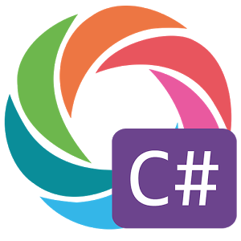

<link rel="stylesheet" href="style.css">

## **Hi there, I'm [Tolga!](https://www.instagram.com/tolgaozkaya_/) :wave:** 

 

 

 
 
 
Hi, I'm Tolga Özkaya, a passionate self-taught Software developer from Turkey.
 
- I am Full Stack Developer.

- I love writing JAVA, and building fun experiments with React.

- Ask me about anything [here](https://github.com/tolgaozkaya/tolgaozkaya/issues).
 
 
Languages and Tools:

 

|  |  |
| ------------- | ------------- |
